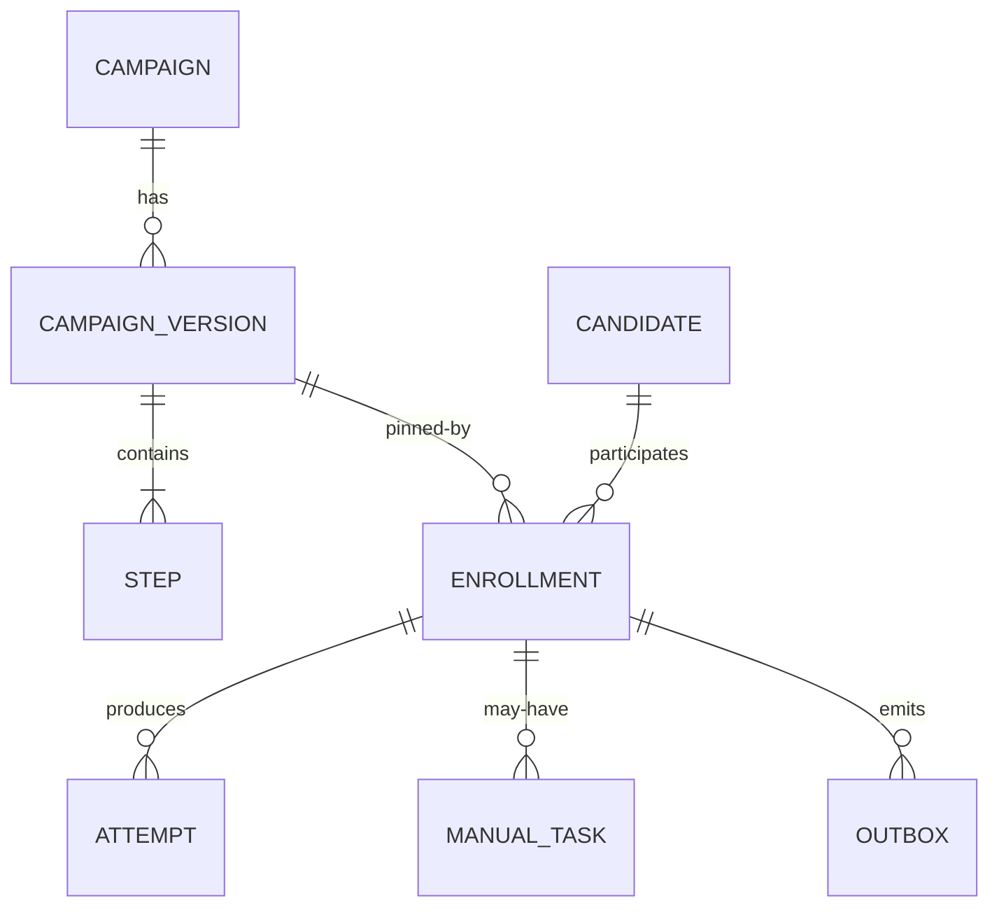
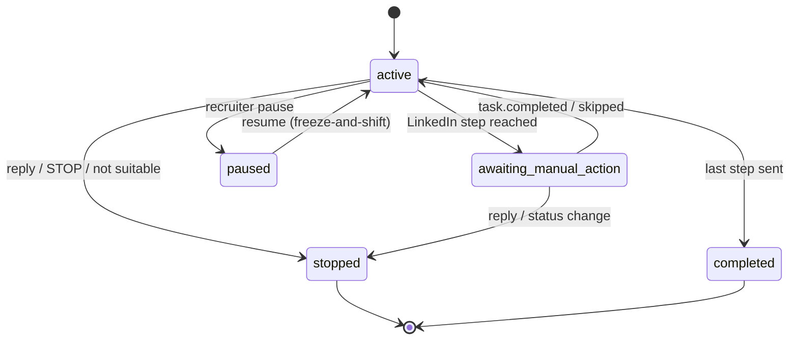

# RFC 01 — Data Model

> **TL;DR** — Postgres is the single system of record. Campaigns are **immutable versioned**
> definitions; each candidate gets one **enrollment** row carrying a **cursor**
> (`current_step_index`, `next_run_at`). Every concrete send is an append-only **attempt** row.
> An **outbox** table gives us atomic handoff to the queue. This shape makes edits cheap,
> cancellation a one-row flip, and the whole system auditable.

| | |
|---|---|
| **Status** | Draft |
| **Decision** | Cursor model + immutable versions + append-only attempts + outbox |
| **Related** | 02 Scheduling · 03 Reliable Delivery · 05 Versioning |

---

## Entities

### Tables (essential columns)

**campaign** — stable identity owned by a recruiter.
`id, recruiter_id, name, active_version_id, created_at`

**campaign_version** — immutable snapshot; the unit enrollments pin to.
`id, campaign_id, version_no, working_hours (jsonb), task_ttl, created_at`
Editing a campaign **never mutates** a version; it creates a new one.

**step** — ordered node within a version.
`id, campaign_version_id, step_index, channel (email|sms|linkedin), offset_from_prev (interval), content_ref`

**candidate** — the person; carries timezone + contact handles.
`id, recruiter_id, timezone, email, phone, linkedin_url`

**enrollment** — THE cursor. One per (campaign, candidate).
`id, candidate_id, campaign_version_id, status, current_step_index, next_run_at, paused_remaining (interval), stop_reason, created_at, updated_at`
- Unique constraint `(campaign_id, candidate_id)` → no same-campaign duplicates.
- Hot index `(status, next_run_at)` → the scanner's only query.

**attempt** — append-only history of every send try.
`id, enrollment_id, campaign_version_id, step_index, channel, idempotency_key (unique), status (sending|sent|failed|skipped_stopped), provider_message_id, error_class, created_at`
- `idempotency_key = hash(enrollment_id, step_index, campaign_version_id)` → dedupe + reconcile.

**outbox** — commands to publish, written in the same TX as the attempt/cursor change.
`id, topic, payload (jsonb), dispatched_at NULL, created_at`

**manual_task** — a LinkedIn (human) step.
`id, enrollment_id, step_index, status (open|done|skipped|expired), expires_at, assigned_to, created_at`

---

## Enrollment state machine

---

## Why this shape

- **One advancing row per enrollment** means an edit or cancel touches exactly one future
  timestamp / one status — not N pre-scheduled rows. Recruiters re-cadence constantly; this keeps
  that O(1).
- **Append-only attempts** give us the audit trail ("did we send step 3, under which version, when,
  with what provider id?") and the idempotency backbone — without coupling it to scheduling.
- **Version pinning** makes every attempt forever attributable to the exact content that produced it.

---

## Alternatives considered

| Alternative | Why rejected |
|---|---|
| **Pre-materialize every step as a row** (`touchpoint` per step upfront) | Edits/re-cadence become mass-updates of N future rows; cancel = N flips. Heavier hot set. We keep the audit benefit via the append-only attempt log instead. |
| **Live-reference campaigns (no versioning)** | Editing copy silently rewrites semantics for in-flight candidates; no attribution of "what we actually sent". Fails the auditability goal. |
| **Document store (Mongo) for enrollments** | We rely on multi-row ACID transactions (attempt + cursor + outbox commit atomically). Postgres gives that natively; a document store would push us toward sagas. |
| **Store cursor in Redis for speed** | Loses durability/auditability and splits the source of truth. Redis is used only for ephemeral rate-limits/locks. |
