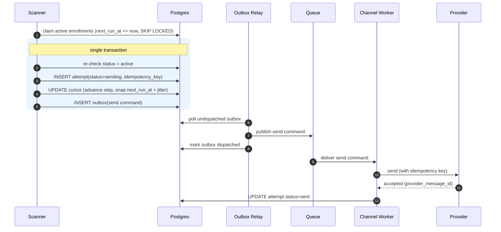

# RFC 02 — Scheduling & Triggering

> **TL;DR** — A **polling Scanner** queries Postgres for `active` enrollments whose
> `next_run_at <= now`, and in one transaction fires the step and advances the cursor. Send times
> are **snapped into the candidate's local working hours at schedule time** and spread with a
> ~20-minute **jitter** to kill the "9am local" thundering herd. We pick polling over delay-queues
> and workflow engines for debuggability and edit-friendliness.

| | |
|---|---|
| **Status** | Draft |
| **Decision** | Polling scanner + cursor + snap-at-schedule + jitter |
| **Related** | 01 Data Model · 03 Reliable Delivery · 04 Reactive Stop |

---

## How it works

1. The Scanner runs continuously (e.g. every few seconds) across a horizontally-scaled worker pool.
2. Each tick it claims a batch of due enrollments:
   ```sql
   SELECT id FROM enrollment
   WHERE status = 'active' AND next_run_at <= now()
   ORDER BY next_run_at
   FOR UPDATE SKIP LOCKED          -- lets many scanner workers share the load safely
   LIMIT :batch;
   ```
3. For each claimed enrollment, inside **one transaction** (see RFC 03 for the outbox detail):
   re-check status → write `attempt(sending)` → advance cursor → insert `outbox` row → commit.
4. Advancing the cursor computes the **next** `next_run_at` from the next step's offset, then
   **snaps** it into the candidate's working-hours window with jitter.

`FOR UPDATE SKIP LOCKED` is the key to scaling the scan: N scanner workers each grab disjoint
batches without stepping on each other, no external lock service needed.

### Working hours + jitter (snap-at-schedule)

When we set `next_run_at` we compute the *actual* send time once:

```
candidate_local = now_or_offset in candidate.timezone
window          = version.working_hours      # e.g. Mon–Fri 09:00–17:00, default
snapped         = next valid window start for candidate_local
next_run_at     = snapped + random(0..20min)  # jitter spreads the herd
```

- Removes the synchronized 09:00:00 spike **before it forms** (cheaper than smoothing it later).
- Looks human — real recruiters don't blast 5,000 identical emails at the same instant.
- Working hours live on the **campaign version**, so they're configurable and audited.

A thin **defer-at-send** re-check remains as a safety net (if something is somehow due outside hours,
push it forward), but the primary gate is at schedule time.

---

## Happy path (one step, end to end)



---

## Scaling notes

- **Hot query** is a single indexed range scan on `(status, next_run_at)`; cheap and predictable.
- **Bursts** (a timezone waking up, or a 10k bulk add) are absorbed by jitter spreading work over
  the window, plus the channel-layer rate limiter (RFC 03/06).
- **Throughput** scales by adding scanner workers (SKIP LOCKED) and channel workers independently.

---

## Alternatives considered

| Alternative | Pros | Why rejected |
|---|---|---|
| **Delay queue** (SQS/Rabbit visibility delay per step) | Offloads timing to infra | Queued messages are effectively write-once — **cancelling or re-cadencing** a scheduled send is painful; max-delay limits; dedup still on us. Edits are constant here, so this fights us. |
| **Durable workflow engine** (Temporal/Cadence, one workflow per enrollment with `sleep`) | Cancellation/edits via signals; crash-safe; reads like code | Millions of long-lived workflows = real operational weight and a new platform dependency. Overkill for hour/day cadences; harder to defend "simple + auditable". **Named as the higher-scale upgrade path.** |
| **Custom timer-wheel / bucketed scheduler** | Tuned for the herd | We'd be rebuilding Temporal-lite; more bespoke code to get wrong. Jitter + indexed polling already tames the herd. |
| **Cron per campaign** | Trivial | Can't express per-candidate independent timelines or timezones. |

**Accepted trade-off:** scheduling latency is bounded by the poll interval (seconds), not instant.
For recruitment cadences this is invisible, and we gain a system any engineer can read and debug.
