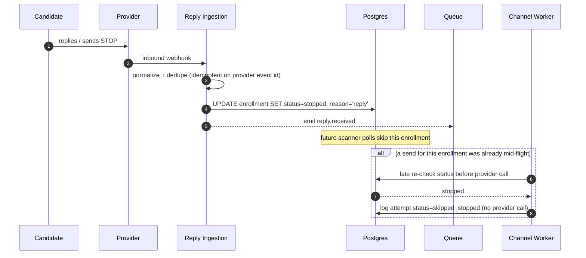
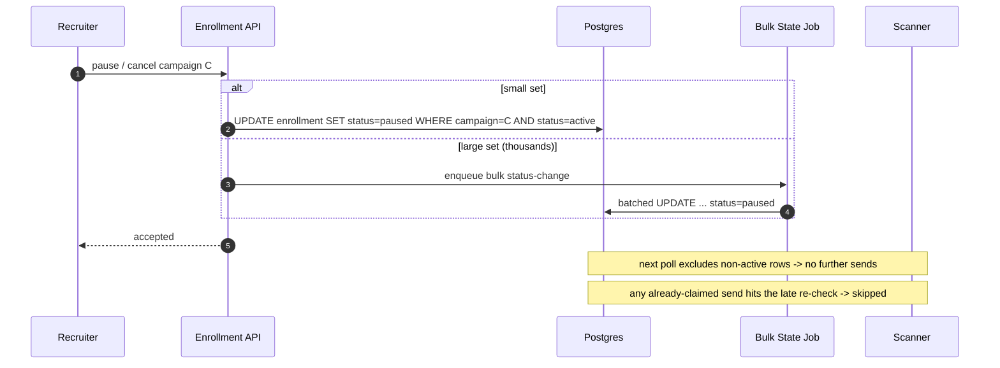

# RFC 04 — Reactive Stop (replies, status changes, cancellation)

> **TL;DR** — Outreach halts via a **layered stop**: an **event-driven** fast path flips the
> enrollment to `stopped` the instant a reply/`STOP`/status-change arrives, and a **late
> transactional re-check** inside the send path is the safety net. This shrinks the
> reply-vs-send race to milliseconds and logs every outcome. A stopped candidate is never sent to.

| | |
|---|---|
| **Status** | Draft |
| **Decision** | Event-driven cancel (primary) + late re-check (safety net) |
| **Related** | 02 Scheduling · 03 Reliable Delivery · 06 Channels |

---

## Triggers that stop outreach

- Candidate **replies** (email) or sends **`STOP`** (SMS).
- Recruiter marks candidate **in process** or **not suitable**.
- Recruiter **pauses** or **cancels** the whole campaign (bulk).

All converge on the same primitive: set `enrollment.status` away from `active`, with a reason.

## Two layers

1. **Event-driven cancel (primary, fast).** Inbound signal → normalized event → `status = stopped`
   (or `paused`). The scanner only ever claims `active` rows, so a stopped enrollment is simply
   never picked up again.
2. **Late re-check (safety net).** Even if an event is delayed/lost, the scanner re-checks status
   **inside the same transaction** that claims the touchpoint, immediately before the outbox write.
   If status changed since selection → abort, log `skipped_stopped`, no send.

We deliberately do **not** take a per-candidate distributed lock to make the race mathematically
impossible — the cost (lock service, contention at 09:00 spikes) outweighs the benefit for
hour/day cadences. We minimize and **log** the window instead (see system non-goals).

---

## Candidate replies (the common case)

## Recruiter cancels / pauses a campaign

Pause is **freeze-and-shift** (RFC 07): we store remaining time-to-next-step and, on resume,
re-add it from now (re-snapped to working hours) — so resuming never triggers a catch-up burst.

---

## Reply detection as a pluggable component

Reply Ingestion exposes one normalized contract — `reply.received(enrollment, channel, provider_event_id)` —
and is **idempotent** on the provider event id (webhooks retry). Internally:
- **SMS**: clean — Twilio inbound webhook + `STOP` keyword.
- **Email**: genuinely hard (threading, auto-responders, OOO). Behind the same interface we can use
  provider reply webhooks or IMAP/threading heuristics. The rest of the system only consumes the
  normalized signal; we do **not** classify intent here (non-goal).

---

## Alternatives considered

| Alternative | Why rejected |
|---|---|
| **Check-at-send only** | A reply arriving during the send window can still race an in-flight send; weaker and no proactive stop. We keep it only as the *safety net*, not the primary. |
| **Event-driven only** | Webhooks can be late, lost, or out-of-order; a delayed webhook would miss an already-fired send. Needs the re-check backstop. |
| **Per-candidate distributed lock (true zero-race)** | Lock service + contention during timezone spikes; complexity not justified for these cadences. |
| **Poll providers for replies** | High latency + cost + rate limits vs. push webhooks. Webhooks are primary; polling only as provider-specific fallback. |
