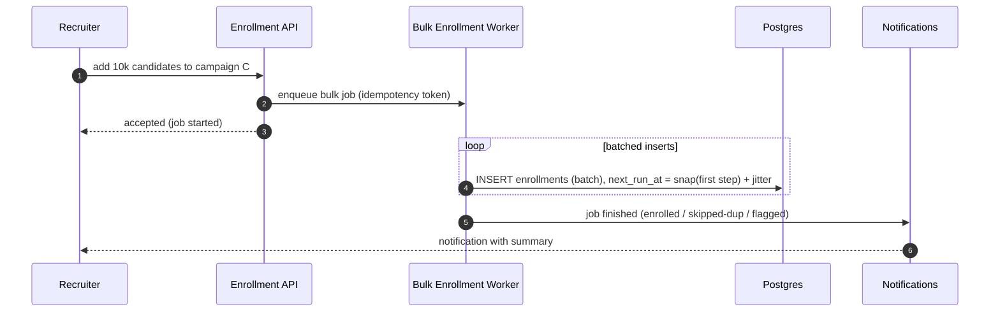

# RFC 07 — Bulk Enrollment, Pause/Resume & Notifications

> **TL;DR** — Adding thousands of candidates is an **async background job** that inserts enrollments
> in idempotent batches with first-step times spread across the jitter window; the recruiter is
> **notified on completion**. Pause/resume is **freeze-and-shift** (no catch-up burst). Same-campaign
> duplicates are blocked by a unique constraint; **cross-campaign enrollment is allowed but flagged**.

| | |
|---|---|
| **Status** | Draft |
| **Decision** | Async bulk job + completion notification · freeze-and-shift pause · cross-campaign flag |
| **Related** | 02 Scheduling · 04 Reactive Stop |

---

## Bulk enrollment (10k in one sourcing session)

Adding thousands of candidates must not be a synchronous mega-transaction and must not dump 10k
sends at once.

- **Async** → the API stays responsive; progress is observable.
- **Idempotent** on `(campaign_id, candidate_id)` → re-running a sourcing import never double-enrolls.
- **Spread + working-hours-aware** → a 2am bulk import does not send at 2am; first sends fan out
  across the jitter window, not a spike.
- **Completion notification** → recruiter gets a summary (enrolled / skipped duplicates / flagged
  cross-campaign), and failures are surfaced, not silent.

---

## Pause / resume — freeze-and-shift

- **Pause**: `status = paused`, store `paused_remaining = next_run_at - now`.
- **Resume**: `next_run_at = snap(now + paused_remaining)`; `status = active`.
- Result: a candidate who had ~2 days left still has ~2 days left after resume. **No catch-up
  burst** of stale sends (which would feel like off-hours spam — exactly what recruiters hate).
- Applies at **campaign level** (bulk-flip, large sets via the same async job pattern) or
  **per-enrollment**.

---

## Dedupe & cross-campaign

| Case | Behaviour |
|---|---|
| Same candidate, same campaign, twice | **Blocked** by unique `(campaign_id, candidate_id)`. |
| Same candidate, two different campaigns | **Allowed but flagged** — surfaced to the recruiter as a first-class signal (a candidate getting outreach from two campaigns is a judgment call, not a system error). |
| Global over-contact | Out of scope now; noted as a future **contact-frequency cap** per candidate. |

The cross-campaign flag matters: it preserves recruiter control and avoids embarrassing
double-outreach without hard-blocking legitimate parallel campaigns.

---

## Notifications

A thin component driven off the event bus: bulk-job completion, bulk failures, and
provider/DLQ failures that need recruiter attention. Keeps humans informed so automation never feels
like a black box.

---

## Alternatives considered

| Alternative | Why rejected |
|---|---|
| **Synchronous bulk insert** | 10k-row request blocks the API, risks timeouts/locks, and offers no progress/notification. |
| **Pause = keep absolute timestamps** | On resume, everything overdue fires at once → thundering herd of stale, off-hours sends. Freeze-and-shift preserves the designed cadence. |
| **Hard-block cross-campaign enrollment** | Over-restrictive; recruiters legitimately run parallel roles. Flagging gives visibility without blocking. |
| **Global frequency cap now** | Useful but adds cross-campaign coordination complexity; deferred as a future guard rather than blocking this design. |
