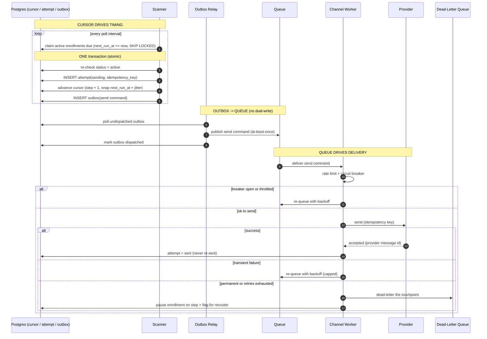

# RFC 08 — The Engine: Cursor, Queue & DLQ

> **TL;DR** — This is the heart of the system in one picture: the **cursor** decides *when* a step
> fires, an atomic transaction writes the attempt + advances the cursor + drops a command in the
> **outbox**, the **queue** decides *how* it gets delivered (with rate limiting, backoff and
> idempotency), and the **DLQ** catches what can't be delivered so nothing is ever silently lost.

| | |
|---|---|
| **Status** | Draft |
| **Reads with** | 01 Data Model · 02 Scheduling · 03 Reliable Delivery |
| **Diagram** | `diagrams/engine.png` (source: `diagrams/engine.mmd`) |

---

## One diagram

---

## 1. How the cursor works

The **cursor** is the per-enrollment pointer `(status, current_step_index, next_run_at)` — it is the
*only* thing that decides when something happens.

- The Scanner polls `WHERE status = 'active' AND next_run_at <= now()` using
  `FOR UPDATE SKIP LOCKED`, so many scanner workers share the load without colliding.
- Firing a step and moving the cursor happen in **one transaction**: re-check status → write
  `attempt(sending)` → set `current_step_index + 1` and the next `next_run_at` (snapped into working
  hours + jitter) → insert the outbox row. Either all of it commits or none of it does.
- Advancing the cursor *is* the schedule for the next step. There is no separate timer to lose.

**Why one row, not one row per step:** edits and cancellations touch a single future timestamp /
status instead of rewriting N pre-scheduled rows (see RFC 01).

## 2. How the queue works

The queue is how work leaves the database and reaches the senders — decoupled and retryable.

- We never publish to the queue directly from the firing transaction (that would be a dual-write).
  Instead the command lands in the **outbox** inside the same transaction, and the **Outbox Relay**
  publishes it **at-least-once**, then marks it dispatched.
- A **Channel Worker** consumes the command, checks the **rate limiter + circuit breaker**, and only
  then calls the provider — passing the **idempotency key** so a redelivered command can't double-send.
- Throttled or breaker-open commands are **re-queued with backoff**, never dropped. Transient
  failures do the same (capped).
- "At-least-once transport + idempotent effect" is the whole trick: we accept that a command may be
  delivered twice, and make the second delivery a no-op.

## 3. How the DLQ works

The Dead-Letter Queue is the safety floor — it guarantees failures are **visible**, not silent.

- A touchpoint reaches the DLQ when it is a **permanent** failure (invalid number, hard bounce,
  unsubscribed) or when **retries are exhausted**.
- On dead-letter we **pause the enrollment on that step** and flag it for the recruiter (via
  Notifications) — we do *not* advance past a failure and pretend it sent.
- Because the `attempt` row and cursor are durable, an operator can inspect, fix, and replay a
  dead-lettered touchpoint without guessing what state it was in.

---

## The one-line mental model

> **The cursor says *when*. The outbox guarantees the handoff. The queue says *how* (with retries).
> The DLQ guarantees nothing disappears.**
