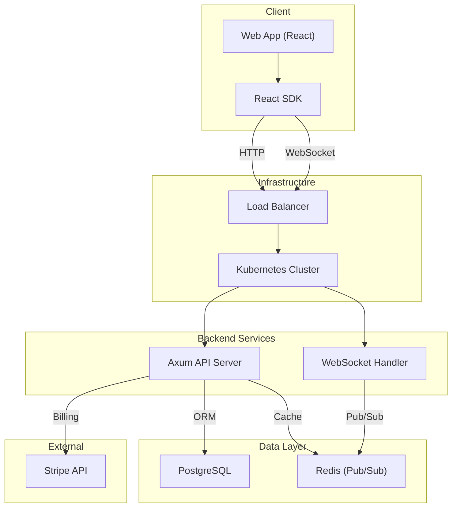
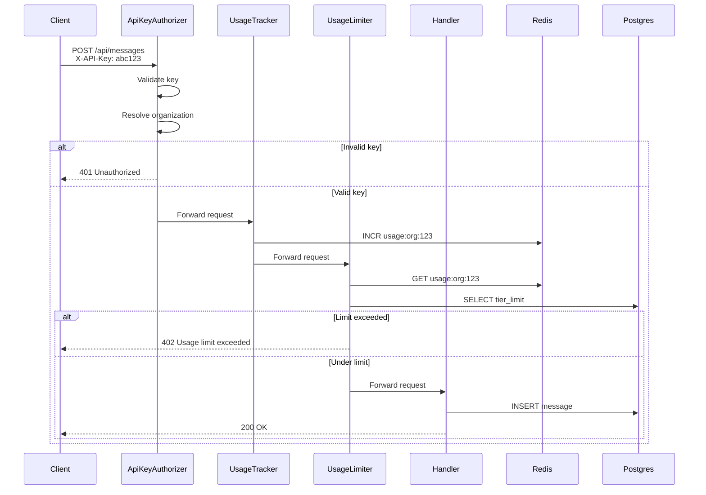
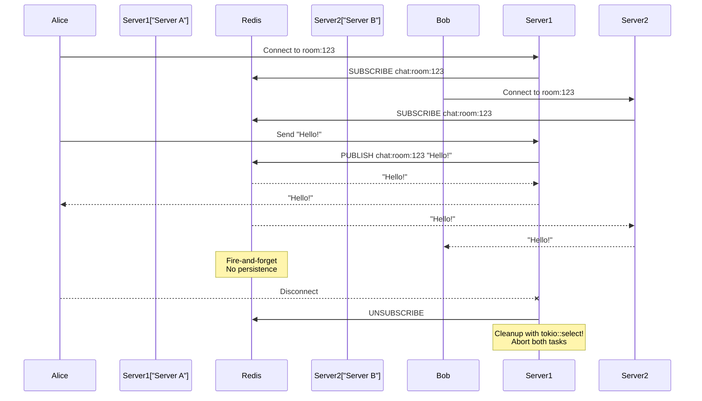

# Rechat architecture — a post-mortem

ReChat is dead. The domain expired. The Kubernetes cluster is gone. The GitHub repos are public and frozen. This is the architecture of a learning project that taught me more about systems design than any tutorial.

## What I built

A chat-as-a-service API. Organizations sign up, get an API key, create channels, send messages. Usage is tracked and billed monthly. A React SDK lets developers drop chat into their app in minutes.

## System architecture

## Backend: Rust with Axum

I chose Rust because I wanted to learn it. Axum is the web framework. It is minimal. It composes.

The server has three layers:
- **HTTP handlers** for REST APIs (channels, messages, participants, organizations)
- **WebSocket handlers** for real-time messaging
- **Custom middleware extractors** for auth, usage tracking, and limiting

The middleware is the interesting part. Axum's `FromRequestParts` trait lets you extract anything from the request. I built:
- `ApiKeyAuthorizer` — validates the API key and resolves the organization
- `UsageTracker` — increments the message counter in Redis
- `UsageLimiter` — checks if the organization has exceeded their tier limit

Each extractor is a type. The compiler ensures every handler that needs auth gets it. No runtime surprises. No decorator magic.

## Request flow: middleware pipeline

## Database: PostgreSQL with SeaORM

SeaORM is the ORM. It generates entities from the database schema. I have tables for organizations, users, channels, messages, api_keys, and usage tracking.

Every table has `organization_id`. No cross-org queries. No accidental data leaks.

## Real-time: Redis Pub/Sub

WebSocket connections are per-client. When a message arrives, it gets published to a Redis channel. Every server subscribed to that channel receives it and forwards it to their local clients.

### WebSocket message flow

This is simple but has trade-offs. Redis Pub/Sub does not persist messages. If a server restarts, it misses messages sent between restart and reconnect. For a learning project, this is fine. For production, I would use Redis Streams.

## Billing: Stripe

I used Stripe for subscriptions. Organizations get a tier (free, pro, enterprise). Each tier has a monthly message limit. The `UsageLimiter` middleware checks the limit before every request.

The hard decision: what if the limiter cannot reach Redis? Or the database? I chose graceful degradation. If I cannot check usage, I let the request through. Only block if I can confirm the limit is exceeded.

This is a product decision, not a technical one. Better to serve a slightly over-limit request than to block everything during a Redis hiccup.

## Frontend: React SDK

The SDK is a React Context. `ChatProvider` manages the WebSocket connection and message state. `Messages`, `ChannelList`, and `MessageInput` are the components.

Messages come from two sources: REST API for history, WebSocket for real-time. Both feed into the same array. `useMemo` combines them.

I published it to npm as `@rechat-sdk/react`. Built with `tsup`. Dual CJS/ESM output. Type declarations included.

## Infrastructure: DigitalOcean Kubernetes

I used Terraform to provision a DO Kubernetes cluster, a managed PostgreSQL database, a managed Redis (Valkey) cluster, and a container registry. Helm charts deploy the Rust backend.

The Dockerfile uses a multi-stage build. Distroless image. 35MB. No shell. No package manager. No attack surface.

## Why it died

Two reasons: security and cost.

Security: I told users to paste their API key in the React SDK props. The key was visible in the HTML. Anyone with DevTools could steal it. I did not build public/private key separation. I did not think about auth until after the SDK was shipped.

Cost: $150 per month for DigitalOcean Kubernetes, managed PostgreSQL, managed Redis, and a load balancer. For a side project with zero users. I could have run it on a single VPS for $20. But I wanted to learn Kubernetes.

## What I would do differently

Skip Kubernetes. Docker Compose on a single droplet. Self-hosted Postgres. Self-hosted Redis. $20 per month. Done.

Build auth first. Not last. Public/private key pairs. The frontend gets a public key. The backend signs the request. The server verifies the signature. Secret never leaves the backend.

Use Redis Streams instead of Pub/Sub. Persistent messages. Consumer groups. Acknowledgment and redelivery.

Add a soft limit notification at 80% usage. I designed it but never implemented the actual notification. The TODO is still in the code.

## The real lesson

I spent 50 hours on this. I learned Rust, Axum, SeaORM, Redis Pub/Sub, Stripe billing, React SDK packaging, Kubernetes, Helm, and Terraform. The project died. The knowledge stayed.

The best way to learn is to build something you care about. Even if it fails. Especially if it fails.

The repos are still there. `rechat-org/rust-service` and `rechat-org/client-facing`. Frozen in time. A snapshot of what I knew in 2023.

If you are learning any of these things, some of this might save you time.
